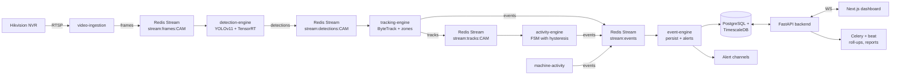

# Architecture overview

## End-to-end data flow



## Why Redis Streams, not Kafka

* **Latency** — sub-millisecond between stages. Important for live state.
* **Footprint** — a single 256MB Redis serves dozens of cameras at 8 fps.
* **Ops** — one process, no ZK/KRaft, no schema registry.
* **Kafka path** — when we cross ~200 cameras/site or need cross-DC fan-out,
  drop in Kafka behind the same `xadd` / `xreadgroup` shim (`event_bus.py`).

## Why FFmpeg subprocess for ingestion, not OpenCV VideoCapture

* OpenCV's RTSP backend silently leaks frames on reconnect and dies on H.265
  keyframe gaps. FFmpeg with `-rtsp_transport tcp -fflags nobuffer` survives
  flaky NVR networks and re-establishes cleanly.
* Hardware decode (`-hwaccel cuda`) costs ~2W/stream on a T4 vs. ~1 vCPU on
  software decode. Critical at 100+ cameras/server.

## State-machine design

Worker activity is modeled as a per-track FSM with a **debounce window
(default 60s)**. A candidate state must hold the majority of votes over the
window before the FSM transitions. This eliminates the "flicker" pattern that
plagues frame-level classifiers and produces fair productivity numbers.

`WAITING_FOR_INPUT` is **not** counted as idle time in KPIs — the input-tray
detector overrides the IDLE candidate when the tray is empty. This is the
critical fairness rule called out in the brief.

## Multi-tenancy

```
Tenant
└── Factory (timezone, location)
    └── ProductionLine (target rate)
        ├── Camera (rtsp_url, fps_target)
        └── Workstation (code, name)
            ├── Camera (FK)
            └── Zone × {seat, machine, input_tray, output_tray}
```

Row-level isolation is enforced at the API layer via the JWT `tenant_id` claim.
For stronger isolation later, switch to schema-per-tenant or DB-per-tenant; the
SQLAlchemy session factory can be parameterized on tenant.

## Observability

* **Metrics** — every service exposes `/metrics`; Prometheus scrapes; Grafana
  visualizes. Key SLIs: ingestion FPS per camera, detection latency p95,
  Redis stream backlog, event-engine ack lag, camera heartbeat ratio.
* **Logs** — structlog JSON to stdout, shipped to Loki via Promtail (add in
  prod compose).
* **Tracing** — OpenTelemetry SDK is wired in the backend; export to your
  collector of choice (Tempo/Jaeger/Datadog).
